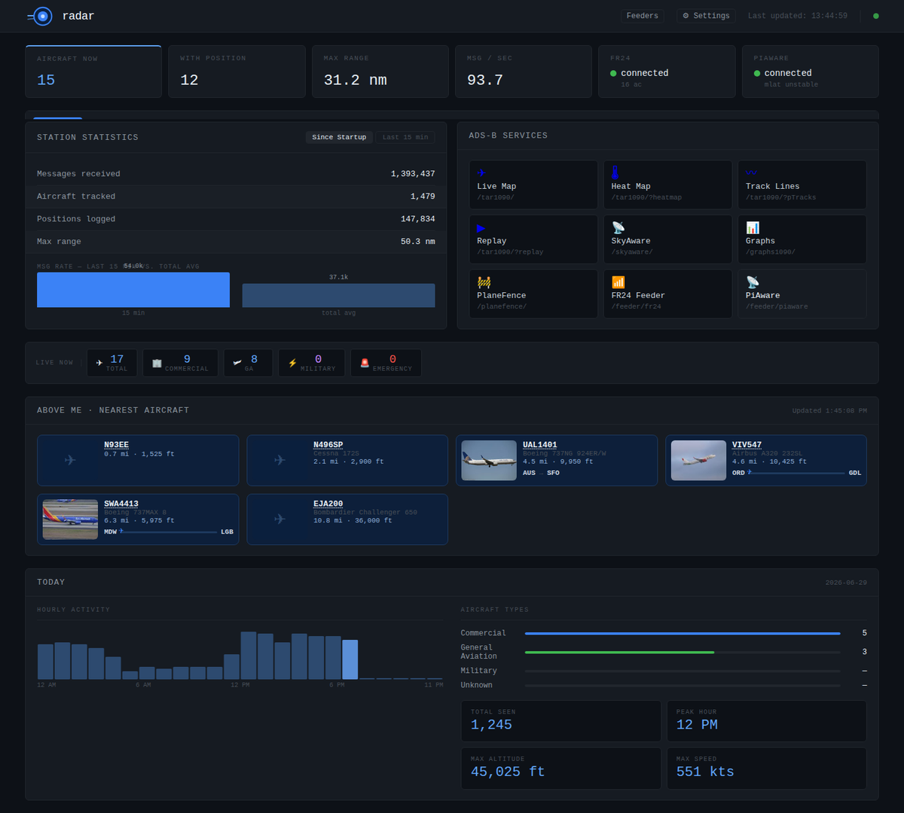

# radar-dash

A self-hosted ADS-B flight tracking dashboard. It reads from a local
[tar1090](https://github.com/wiedehopf/tar1090) / `readsb` / ultrafeeder receiver
and presents a richer view than tar1090 alone: an "above me" panel with route and
photo, live stats and historical records, flight-path and path-heat maps, route
enrichment, and a configurable interesting-aircraft watchlist.

> Node.js / Express + SQLite. No build step.



## Requirements

- Node.js 18+ (developed on v24)
- A reachable ADS-B receiver exposing the tar1090 JSON API (`/data/aircraft.json`)

## Quick start

```bash
git clone <your-fork-url> radar-dash
cd radar-dash
npm install
cp .env.example .env       # then edit .env — at minimum set ADSB_HOST + station lat/lon
npm start                  # serves on http://localhost:3010
```

Open `http://localhost:3010`.

## Running in Docker

You can run `radar-dash` easily using the official prebuilt Docker image `tempeduck/radar-dash:latest`.

### 1. Set up the compose file
Copy the example compose file:
```bash
cp docker-compose.yml.example docker-compose.yml
```

### 2. Configure environment
Copy `.env.example` to `.env` and configure it:
```bash
cp .env.example .env
```
At a minimum, set `ADSB_HOST` (e.g., your receiver's IP) and `ADSB_STATION_LAT/LON`.

### 3. Start the container
```bash
docker compose up -d
```
The dashboard will be available on `http://localhost:3010`.

#### Optional: Local Feeder Detection
If you run the dashboard on the **same** machine as your ADS-B receiver/feeders, you can mount the host's Docker socket in `docker-compose.yml` to allow the dashboard to auto-detect your feeder containers without SSH keys or passwords:
```yaml
    volumes:
      - ./data:/app/data
      - /var/run/docker.sock:/var/run/docker.sock
```
Then, set **Feeder Detection Mode** to `local` in the settings page.

## PWA / installing the app

The dashboard is a **Progressive Web App** — it can be installed to a phone/desktop
home screen and runs full-screen with an offline app shell (live flight data still
needs a connection; only the shell is cached). Nothing to enable in the app.

The one catch is a browser rule: **install + service workers only work from a
"secure context"** — that means **HTTPS**, *or* the special-cased **`http://localhost`**.
A plain `http://<LAN-IP>:3010` origin is *not* secure, so on that URL the app runs as
a normal website and the install option simply doesn't appear. You don't need a public
domain to fix this — you just need to terminate TLS somewhere. Pick whichever fits:

| You want… | Do this | Cert hassle |
|-----------|---------|-------------|
| Install on the **host machine** | Open `http://localhost:3010` — already a secure context | none |
| Install on **phones, no domain** *(recommended)* | Put the container on a [Tailscale](https://tailscale.com) tailnet and run `tailscale serve --bg 3010` — gives a real, auto-renewing `https://<machine>.<tailnet>.ts.net` | none |
| **Share a public link** quickly | `cloudflared tunnel --url http://localhost:3010` — instant `https://….trycloudflare.com` (URL changes each run) | none |
| **LAN-only HTTPS** by IP/hostname | Generate a trusted cert with [`mkcert`](https://github.com/FiloSottile/mkcert), mount it, set `HTTPS_CERT`/`HTTPS_KEY` (see below) | install mkcert's CA on each device |

> ⚠️ A **bare self-signed cert is not enough.** If the browser shows a certificate
> warning, the origin is still treated as insecure and the service worker stays
> blocked. The cert must chain to a CA your device trusts — which is exactly what
> Tailscale, Let's Encrypt, and mkcert (after installing its local CA) give you.

### Built-in HTTPS listener (the mkcert / mounted-cert path)

Set these and the server adds a TLS listener **alongside** the normal HTTP port:

```bash
HTTPS_CERT=/app/certs/cert.pem
HTTPS_KEY=/app/certs/key.pem
HTTPS_PORT=3443            # optional, default 3443
```

In Docker, mount the cert and publish the port (both are commented stubs in
`docker-compose.yml.example`):

```yaml
ports:
  - "3010:3010"
  - "3443:3443"
volumes:
  - ./certs:/app/certs:ro
```

Then visit `https://<host>:3443` and install. Example with mkcert for a LAN box:

```bash
mkcert -install                                   # trust the local CA (per device)
mkcert -cert-file certs/cert.pem -key-file certs/key.pem 10.0.0.5 radar.local
```

(`tailscale serve` and `cloudflared` sit *in front* of the app and need none of
this — the plain HTTP listener stays up for them and for loopback health checks.)

## Configuration

All configuration is via environment variables, loaded from a project-local `.env`
(see `.env.example` for the full annotated list). The essentials:

| Variable | Purpose |
|----------|---------|
| `ADSB_HOST` / `ADSB_PORT` | Your tar1090/readsb receiver (default `127.0.0.1:8080`) |
| `ADSB_STATION_LAT/LON/ALT_FT` | Antenna location, for overhead/distance math |
| `RADAR_DASH_PORT` | HTTP port (default `3010`) |
| `BRAND_NAME` / `BRAND_DOMAIN` | Header branding (purely cosmetic) |
| `HOME_COUNTRY_ISO` | Domestic vs international breakdowns (default `US`) |
| `ADMIN_TOKEN` | Protects `/admin/*` — see Security below |

### Feeder detection

The Feeders page (`/feeder/`) shows which aggregators (FR24, PiAware, ADSBexchange,
PlaneFinder, …) are installed and healthy. The feeder list lives in one catalog
(`src/data/feeders.json`); `installed`/health are **detected at runtime, with no
per-feeder configuration**. The dashboard only reads state — it never edits your stack.

Detection is fully automatic:

- **FR24 / PiAware** — probed over HTTP on their stats ports (works in any mode).
- **Container feeders** (PlaneFinder, RadarBox, RadarVirtuel, …) — found via read-only
  `docker inspect`.
- **Ultrafeeder aggregators** (ADSBexchange, adsb.fi, adsb.lol, airplanes.live, …) —
  detected by parsing ultrafeeder's own `ULTRAFEEDER_CONFIG`, so whatever you feed shows
  up automatically.

Pick a detection mode at **`/admin/settings` → Feeder detection** (the env vars only seed
the first-run default):

| Mode | What it does |
|------|--------------|
| `local` | Inspects the Docker daemon on **this** box — for installs where the dashboard and feeders run on one host. |
| `remote` | Runs `docker inspect` over SSH on the receiver. Default when `ADSB_SSH_HOST` is set. |
| `off` | No detection; feeders come only from the `FEEDER_ENABLED_KEYS` override. Default otherwise. |

`FEEDER_ENABLED_KEYS` is an **optional override** — a comma-separated list to force a
feeder "installed" when it can't be auto-detected (e.g. in `off` mode, or an aggregator
we can't probe). Normally left blank.

#### Remote (SSH) auth

In `remote` mode, set the host/user at `/admin/settings` and choose an auth method:

- **Key (recommended).** Only the **path** to your private key is stored (set it at
  `/admin/settings`, or seed via `ADSB_SSH_KEY`; default `~/.ssh/id_ed25519`); the key
  itself never leaves `~/.ssh`. No encryption needed. This is the safest option.
- **Password.** For hosts where you can't use a key:
  1. Install **`sshpass`** on the box running radar-dash (`apt install sshpass`). It's
     only needed for password auth.
  2. (Recommended) Set a master encryption key so the password is encrypted with a key
     you control rather than an auto-generated file:
     ```bash
     # add to your .env (or ~/projects secrets file)
     RADAR_SECRET_KEY=$(openssl rand -base64 32)
     ```
     If you skip this, radar-dash auto-generates `data/.master.key` (mode `0600`) on
     first use and prints a warning — back that file up; losing it means re-entering
     the password.
  3. At `/admin/settings`, set **SSH auth → password** and enter the password, then save.

  The password is encrypted at rest with **AES-256-GCM** into `data/credentials.enc`
  (mode `0600`). It is **never** written to `settings.json` and is **never** returned by
  the settings API — the field reads back as `set`/`not set` only. Leave the field blank
  on later saves to keep the stored value; clear it to remove it.

  > Security note: encryption-at-rest protects backups, git, and a casual `cat` — not an
  > attacker who already has the box and the key. Key auth avoids storing a reusable
  > secret at all, so prefer it when you can.

## Running as a service (systemd)

Copy `radar-dash.service.example` to `/etc/systemd/system/radar-dash.service`, edit the
`User`, paths, and `node` binary for your system, then:

```bash
sudo systemctl daemon-reload
sudo systemctl enable --now radar-dash
journalctl -u radar-dash -f
```

## Data & databases

SQLite files are created automatically under `data/` (gitignored): aircraft snapshots,
daily/monthly/yearly stats and records, the route/registration caches, the watchlist,
and the path-heat accumulator. Just back up the `data/` directory.

## Security

The dashboard root is read-only and safe to expose. `/admin/*` (the runtime settings
page) **fails closed**; you can unlock it in one of these ways:

- **Token (default):** set `ADMIN_TOKEN` and open `/admin/settings?token=YOUR_TOKEN`
  (or send the `X-Admin-Token` header). Works over the host's IP or a domain alike.
- **Authenticating proxy:** if a proxy like Cloudflare Access fronts `/admin`, set
  `ADMIN_TRUST_PROXY_HEADER=true` to accept its `cf-access-authenticated-user-email`
  identity header.

With neither configured, `/admin` returns 401 to everyone. For a trusted LAN or
localhost-only install where you want no auth at all, set `ADMIN_DISABLE_AUTH=true`
(the server logs a loud warning at boot — never use it on an exposed host).

> ⚠️ Only enable `ADMIN_TRUST_PROXY_HEADER` when a proxy actually sits in front and
> strips that header from outside requests — it is trivially spoofable otherwise and
> would bypass the token. If you serve `/admin` over plain HTTP (e.g. by IP with no
> TLS), the token travels in cleartext, so keep that to a trusted LAN.

## Credits & data sources

This project relies on excellent community data and services — please respect their
terms and rate limits:

- [tar1090](https://github.com/wiedehopf/tar1090) / [readsb](https://github.com/wiedehopf/readsb) — receiver software
- [adsb.im routeset](https://adsb.im) & [adsbdb](https://www.adsbdb.com) — route / registration enrichment
- [OpenSky Network](https://opensky-network.org) — historical flight lookups
- [ADSBExchange](https://www.adsbexchange.com) — wide-area track traces
- [plane-alert-db](https://github.com/sdr-enthusiasts/plane-alert-db) — interesting-aircraft watchlist
- [OurAirports](https://ourairports.com) — airport coordinates

## License

MIT — see [LICENSE](LICENSE).
